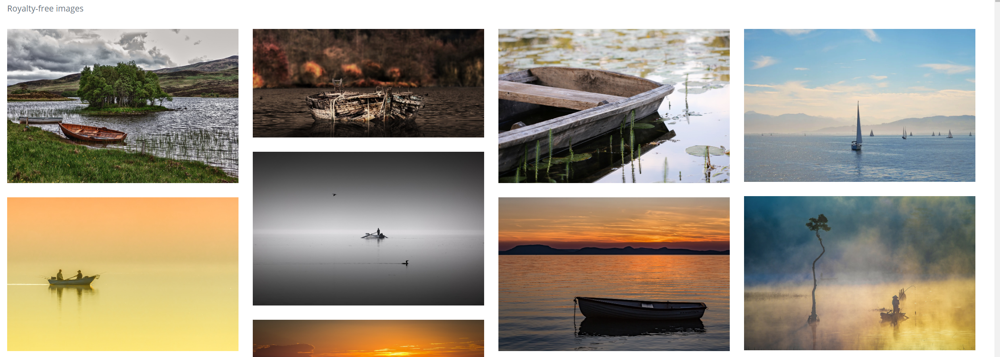
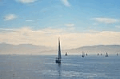

```{css echo=FALSE}
body {

  font-family: Arial, sans-serif;
  line-height: 1.6;
  margin: 20px;
}

h1 {
  color: #B2675E;
  font-size: 30px;
  font-weight: bold;
}

h2 {
  color: #2C4C60;
  font-size: 26px;
  font-weight: bold;
}

h3 {
  color: #B2675E;
  font-size: 22px;
  font-weight: bold;
}

h4 {
  color: ##darkgreen;
  font-size: 20px;
  font-weight: bold;
}

h5 {
  color: ##2C4C60;
  font-size: 18px;
  font-weight: bold;
}

p {
  font-size: 16px;
}

code {
  font-family: Consolas, monospace;
  font-size: 14px;

}

pre {
  padding: 10px;
}
```

```{r setup, include=FALSE}
knitr::opts_chunk$set(echo=TRUE, message=FALSE, warning=FALSE, error=FALSE)
library(tidyverse)
photo_data <- read_csv("selected_photos.csv")
```

## Introduction

### Search words

Two words that I used to search are "lake boat" Since I love water and lakes, I wanted to get lake pictures. So I searched "silent lake" before "lake boat", but that didn't return over 200 pictures. I could find a nice picture with a boat on a lake, then I changed my words to "lake boat" 

{width="80%"}

### Observed features of the photos

1.  Tags: common tags are "lake", "boat" and "sunset"

2.  page orientation: Mostly landscape

3.  Colors: The main colors is blue and Orange is the next common color.

```{r}
knitr::kable(photo_data%>% select(pageURL))
```

{width="80%"}

## Key features of selected photos

```{r}
meanLikesProportion <- photo_data$likesProportion %>% mean(na.rm=TRUE)
total_photos <- nrow(photo_data)
meanViews <- photo_data$views %>% mean(na.rm=TRUE)
boat_photos <- sum(str_detect(photo_data$tags, "boat"))
```

1.  The mean proportion of likes for the selected photos is `r round(meanLikesProportion, 1)`%.

2.  A total of `r total_photos` photos were selected for analysis.

3.  Among the selected photos, `r boat_photos` have "boat" tags.

4.  Then mean number of views for the selected photos is `r round(meanViews)`.

## Creativity

```{r}
#seperate rows with "," to get a single tag from tags 
tags_new <- photo_data%>%
  separate_rows(tags, sep = ", ")
tags_new
# count number of each tags
tags_count <- tags_new%>%
  group_by(tags)%>%
  summarise(n())
#rename "n()" to "freq" 
tags_count<- tags_count %>%
  rename(freq = 2)
# Filter the top 5 tags from tags_count
top_tags_counts <- tags_count %>%
  filter(freq %in% head(sort(freq, decreasing = TRUE), 5))

  
# Plot the bar plot
ggplot(top_tags_counts, aes(x = tags, y = freq)) +
  geom_bar(stat = "identity", fill = "skyblue") +
  labs(x = "Tags", y = "Frequency", title = "Top 5 Most Common Tags") 

```

I demonstrated creativity by creating a plot representing top 5 most common tags. To get a separated tags , the contents from the Lab3A and Lab3B were useful like separate_rows() function to unnest the variable tags with ", " , group_by(), rename(), and filter().

## Learning reflection
In Module 3, I gained extensive knowledge in manipulating data from CSV and JSON formats through completing lab tasks and the project. It was interesting to discover how I could craft a new data frame tailored to my exploration needs by manipulating and summarizing data. Additionally, I learned to create calculated variables derived from dataset exploration. Utilizing APIs in the project further deepened my understanding of their functionality and application. This experience not only enhanced my data manipulation skills but also broadened my comprehension of APIs, underscoring their importance in data analysis. Lastly, reusing some functions from previous labs were a good way of revision.


## Appendix
```{r file='exploration.R', eval=FALSE, echo=TRUE}

```

