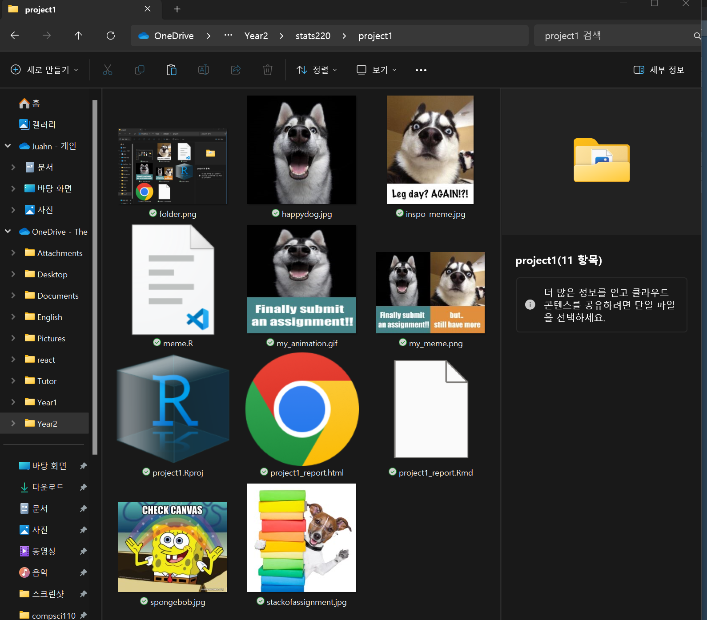
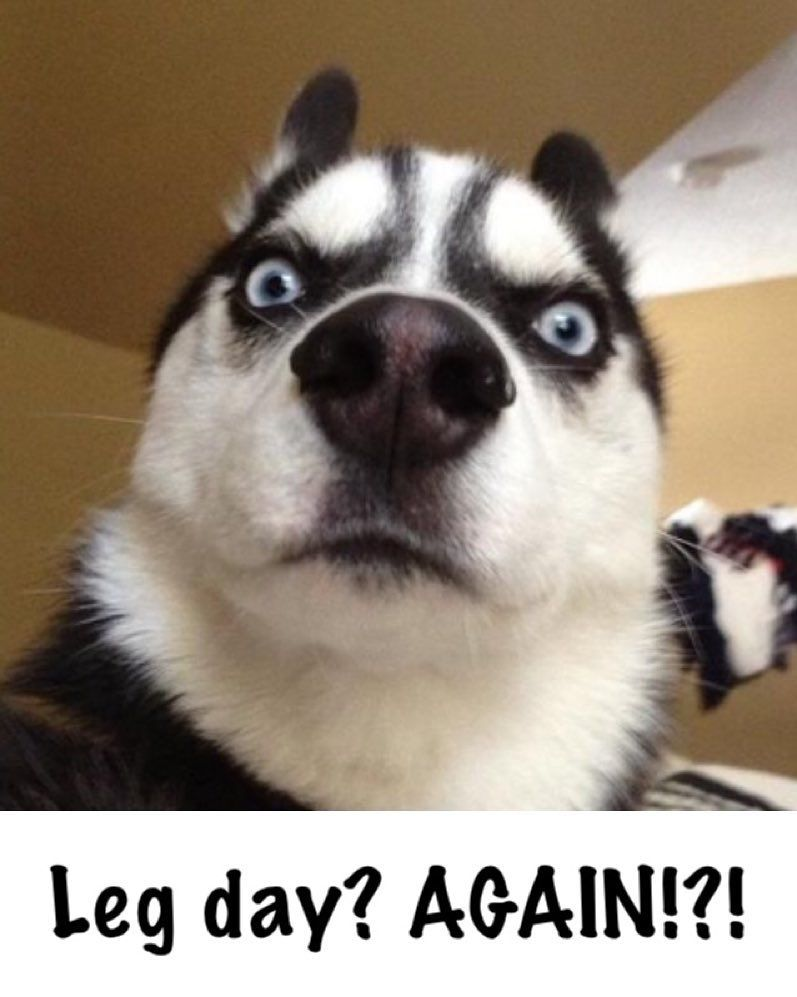
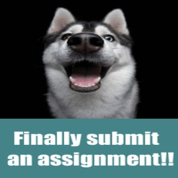

```{r setup, include=FALSE}
knitr::opts_chunk$set(echo=TRUE, message=FALSE, warning=FALSE, error=FALSE)
```

```{css}
body {

  font-family: Arial, sans-serif;
  line-height: 1.6;
  margin: 20px;
}

h1 {
  color: #B2675E;
  font-size: 28px;
  font-weight: bold;
}

h2 {
  color: #B2675E;
  font-size: 24px;
  font-weight: bold;
}

h3 {
  color: #B2675E;
  font-size: 20px;
  font-weight: bold;
}

p {
  font-size: 16px;
}

code {
  font-family: Consolas, monospace;
  font-size: 14px;
  background-color: #f4f4f4;
}

pre {
  background-color: #1B2631 ;
  color: #f4f4f4;
  padding: 10px;
}


```

## Project requirements
<!-- Briefly summarise how you have met the requirements related to working with GitHub (and optionally GitHub pages). Include the links to your repo and to your website (these are different links).-->
[Here is the link to my Stats220 repo]("https://github.com/Juka526/stats220")

I created Stats220 repo on my GitHub account.
The GitHub repo has a README.md file so that the viewer can clarify the purpose of this repo and its contents. It also contains some information about myself like my favorite football team, musician and what I am majoring in. Additionally, this file meets all the required Markdown syntax with two different levels of headers, use of two different types of bullet points (ordered and unordered), use of bold and italics, and use of links to other websites.

<!--Include a screenshot of the project folder you have created on your computer using markdown. It should be obvious in the screenshot that you have set up and used .Rproject within RStudio, and all files and images used for this project should be visible.
Write at least 100 words for this section-->
{width=80%}

*project1.Rproj* is clearly in the project folder and all the images used in the animation and meme are in the folder.


<!--Use markdown to display the “inspo” meme (i.e. use )
Describe the key components of the image you re-created and the features you changed
Include the code used to create your meme in the code chunk labelled “meme-code”
When you knit your Rmd file to HTML, your meme will be produced and included in the output (make sure your R code does produce your meme as output)
Include the code used to create your animated meme in the code chunk labelled “animation-code”
When you knit your Rmd file to HTML, your animated meme will NOT be produced and included in the output
Instead, include the GIF you created in Part B using markdown-->
## My meme

### My inspo meme

{width=50%}

The key component I re-created was the text and context of the meme. The text under the picture was "leg day again!" which shows the disappointment from the leg day. The re-created meme has a different background colour of the text box as well as its content to show the disappointment from assignments that I have to do after finishing another assignment. Furthermore, I added one happy dog picture with a text box to show excitement from finishing an assignment and to exaggerate depressing emotions after immense happiness.
```{r meme-code, eval=TRUE}
# Load the magick library
library(magick)

#links to image and set the size
serious_dog <- image_read("https://i.pinimg.com/originals/b1/7e/21/b17e218b08f84b12d346128691cfe02c.jpg") %>%
  image_scale(200)

#links to image and set the size
happy_dog <- image_read("https://static.boredpanda.com/blog/wp-content/uploads/2015/09/10974198_764347496952795_4957312736937536277_o__700.jpg") %>%
  image_scale(200)

#Text box for the serious dog picture 
orange_square <- image_blank(width = 200,
                             height = 100,
                             color = "#e08d3c") %>%
  image_annotate(text = "but.. \nstill have more",
                 color = "#FFFFFF",
                 size = 28,
                 font = "Impact",
                 gravity = "center")

#Text box for the happy dog picture
first_square <- image_blank(width = 200,
            height = 100,
            color = "#448488") %>%
  image_annotate(text = "Finally submit \n an assignment!!",
                  color = "#FFFFFF",
                  size = 28,
                  font = "impact",
                  gravity = "center")

#combine happy_dog and text box
first_row <- c(happy_dog, first_square) %>%
  image_append(stack=TRUE)

#combine cropped serious_dog and text box
second_row <- c(image_crop(serious_dog, "200x200"), orange_square) %>%
  image_append(stack = TRUE)

#put two images with text boxes together
my_meme <- c(first_row, second_row) %>%
  image_append()

#save meme to "my_meme.png"
image_write(my_meme, "my_meme.png")

#displaying my_meme
my_meme
```


```{r animation-code, eval=FALSE}

# Load the magick library
library(magick)

#links to image and set the size
serious_dog <- image_read("https://i.pinimg.com/originals/b1/7e/21/b17e218b08f84b12d346128691cfe02c.jpg") %>%
  image_scale(200)

#links to image and set the size
happy_dog <- image_read("https://static.boredpanda.com/blog/wp-content/uploads/2015/09/10974198_764347496952795_4957312736937536277_o__700.jpg") %>%
  image_scale(200)


#Text box for the serious dog picture
gif_square <- image_blank(width = 200,
                             height = 100,
                             color = "#e08d3c") %>%
  image_annotate(text = "I can't believe it.",
                 color = "#FFFFFF",
                 size = 28,
                 font = "Impact",
                 gravity = "center")

#Text box for the happy dog picture
first_square <- image_blank(width = 200,
            height = 100,
            color = "#448488") %>%
  image_annotate(text = "Finally submit \n an assignment!!",
                  color = "#FFFFFF",
                  size = 28,
                  font = "impact",
                  gravity = "center")

#combine happy_dog and text box
first_row <- c(happy_dog, first_square) %>%
  image_append(stack=TRUE)


#set first_row as a first frame
first_frame <- image_scale(first_row)

#set second frame with spongebob saying "check canvas"
second_frame <- image_scale(image_read("https://media.makeameme.org/created/check-canvas-0e47437a4f.jpg"))

#set third frame with dog showing stack of assignments
third_frame <- image_scale(image_read("https://media.istockphoto.com/id/166223622/photo/school-dog.jpg?s=612x612&w=0&k=20&c=OyEvTWUaPczUz6Cx-wv83XTj_d3frjJiPRgypixVbbk="))

#set fourth_frame with serious_dog with gif_square
fourth_frame <- image_scale(c(image_crop(serious_dog, "200x200"), gif_square) %>%
                              image_append(stack = TRUE))

#set all the frame in one same size and put them altogether
frames <- image_resize(c(first_frame, second_frame, third_frame, fourth_frame), '300x300!')

#make animation with frames with 1fps.
animation <- image_animate(frames, fps = 1)

#save animation "my_animation.gif"
image_write(animation, "my_animation.gif")

#displaying my_animation
my_animation
```


## Creativity
I showcased creativity within this project by crafting my meme. Initially, I employed the 'image_resize' feature from the 'magick' library, a technique not addressed in our lectures or labs. During lectures, we solely discussed scaling individual images. However, for my meme, I required all frames/images to be uniform in size, prompting me to utilize the 'image_resize' function.


## Learning reflection

I learned many techniques and how to combine them. Before taking module 1, I did not know other ways like RMD to create HTML, CSS, PPTX, and docx files. Moreover, using rmd is efficient and tidy for combining different techs. CSS, HTML, and R code are written and work together in this one file. Creating memes and animations was interesting because I had not created anything like that before, and thanks to this project, I could quickly learn by utilizing the magick library. I am curious to learn and produce different files, such as PPTX, docx, and R code, to try different libraries.


